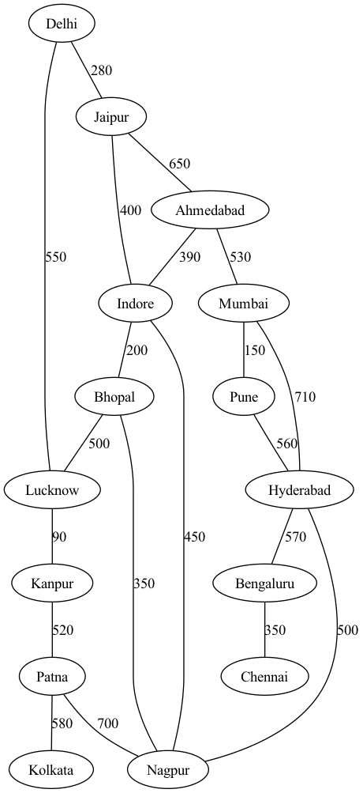

# Transportation Network Analysis Engine

A graph-based transportation network simulator built in C++ to explore routing, network optimization, flow analysis, and resilience analysis using real-world inspired city and route datasets.

This project was developed to gain hands-on experience with graph theory, data structures, and modern C++ by implementing several classical graph algorithms on a transportation network.

---

## About The Project

Transportation systems can naturally be represented as graphs, where cities act as nodes and routes act as weighted edges.

This project simulates such a network and provides tools to:

- Explore network connectivity
- Find optimal routes
- Analyze network robustness
- Compute flow capacity
- Identify critical cities and routes
- Visualize transportation networks

---

## Features

### Route Planning

- Dijkstra's Shortest Path Algorithm
- A* Search Algorithm
- Route Optimization based on:
  - Distance
  - Travel Time
  - Cost

### Network Traversal

- Breadth First Search (BFS)
- Depth First Search (DFS)

### Network Optimization

- Minimum Spanning Tree (Kruskal's Algorithm)
- Maximum Flow Analysis (Edmonds-Karp Algorithm)

### Network Analytics

- Connected Components Detection
- Average Degree Analysis
- Network Density Analysis
- Most Connected City Identification

### Network Resilience Analysis

- Articulation Point Detection
- Bridge Detection
- Critical City Identification
- Critical Route Identification

### Visualization

- DOT Graph Export
- Graphviz Integration
- PNG/SVG Rendering Support

---

## System Architecture

```text
Transportation Dataset
          │
          ▼
      CSV Reader
          │
          ▼
      Graph Model
          │
 ┌────────┼────────┐
 ▼        ▼        ▼
Algorithms Analytics Visualization
          │
          ▼
      Console Output
```

---

## Technologies Used

| Category | Technology |
|-----------|------------|
| Language | C++20 |
| Build System | CMake |
| Data Storage | CSV Files |
| Visualization | Graphviz |
| Version Control | Git & GitHub |

---

## Algorithms Implemented

| Category | Algorithms |
|-----------|------------|
| Traversal | BFS, DFS |
| Routing | Dijkstra, A* |
| Optimization | Kruskal MST |
| Flow Analysis | Edmonds-Karp |
| Resilience | Articulation Points, Bridges |

---

## Sample Output

### Network Statistics

```text
Nodes: 15
Edges: 20
Connected Components: 1
Average Degree: 2.67
Density: 0.095
Most Connected City: Nagpur
```

### Route Optimization

```text
Shortest Route
Delhi -> Jaipur -> Ahmedabad -> Mumbai -> Pune
Distance: 1610 km

Fastest Route
Delhi -> Jaipur -> Indore -> Ahmedabad -> Mumbai -> Pune
Travel Time: 27 hrs

Cheapest Route
Delhi -> Jaipur -> Ahmedabad -> Mumbai -> Pune
Cost: 2550
```

### Resilience Analysis

```text
Critical Cities
Patna
Hyderabad
Bengaluru

Critical Routes
Patna - Kolkata
Bengaluru - Chennai
Hyderabad - Bengaluru
```

---

## Network Visualization

The network can be exported in DOT format and rendered using Graphviz.



Generate the visualization:

```bash
dot -Tpng network.dot -o network.png
```

---

## Building The Project

### Clone Repository

```bash
git clone https://github.com/garvit-budania/Transportation-Network-Analysis-Engine.git
cd Transportation-Network-Analysis-Engine
```

### Configure

```bash
cmake -S . -B build
```

### Build

```bash
cmake --build build
```

### Run

```bash
./build/tnae
```

---

## Development Journey

The project was developed incrementally:

- Graph representation and CSV-based data loading
- BFS and DFS traversal
- Dijkstra and A* routing
- Minimum Spanning Tree generation
- Maximum Flow analysis
- Network analytics and resilience analysis
- Multi-criteria route optimization
- Graph visualization using Graphviz

---

## Future Improvements

- Docker Containerization
- GitHub Actions CI/CD Pipeline
- Larger Transportation Datasets
- REST API Support
- Interactive Visualization Dashboard

---

## Author

**Garvit Budania**

Developed as a personal project to strengthen my understanding of graph algorithms, data structures, software design, and modern C++ development.
